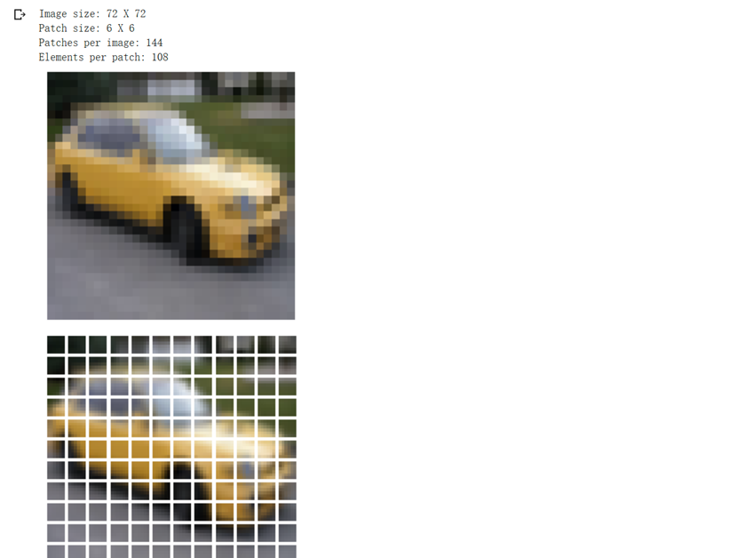
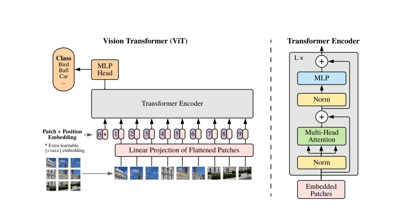
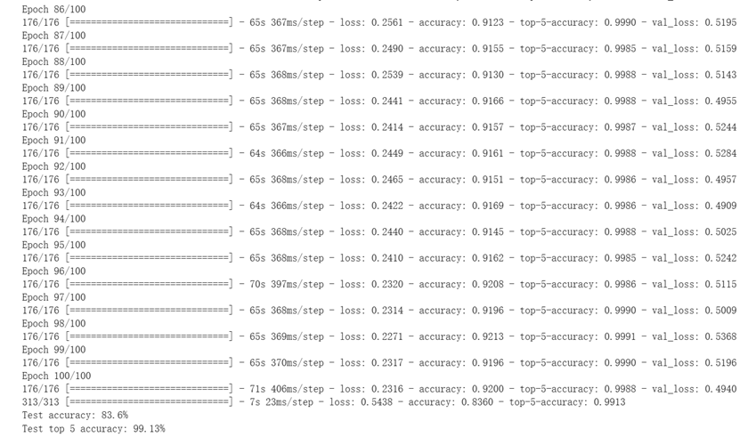

# 5.16 Vision Transformer

## 实验过程

- [x] 下载和处理数据集
- [x] 配置超参数
- [x] 数据增强
- [x] 实现多层感知机
- [x] 构建模型
- [x] 训练与测试模型

---

## 实验环境

- Python 3 Google Compute Engine

- TensorFlow 2.4 

- CIFAR-100

---

## 实验步骤
### 下载和处理数据集

- CIFAR-10是一个彩色图像数据集，由Hinton 的学生Alex Krizhevsky 和Ilya Sutskever 整理，一共包含10 个类别的RGB 彩色图片：飞机（ airplane ）、汽车（ automobile ）、鸟类（ bird ）、猫（ cat ）、鹿（ deer ）、狗（ dog ）、蛙类（ frog ）、马（ horse ）、船（ ship ）和卡车（ truck ）。
         
- 每个图片的尺寸为32 × 32 ，每个类别有6000个图像，数据集中一共有50000 张训练图片和10000 张测试图片。



```
num_classes = 10    # 分类数目为10个
input_shape = (32, 32, 3)   # 输入的图片形状为 32x32 像素，3个通道（RGB）

(x_train, y_train), (x_test, y_test) = keras.datasets.cifar10.load_data()   
# 加载 CIFAR10 数据集，并将其拆分为训练和测试集，x_train和x_test为图像数据，y_train和y_test为标签数据
```


### 设置超参数

- 调整图像块大小，以及参数

```
learning_rate = 0.001  # 学习率，控制模型更新的步长大小
weight_decay = 0.0001  # 权重衰减，控制模型复杂度，防止过拟合
batch_size = 256  # 每次训练使用的样本数量
num_epochs = 100  # 训练的总轮数
image_size = 72  # 将输入图像的大小调整为此大小
patch_size = 6  # 从输入图像中提取的图像块的大小
num_patches = (image_size // patch_size) ** 2  # 输入图像中的图像块数
projection_dim = 64  # Transformer模型中的投影维度，用于计算每个图像块的嵌入向量
num_heads = 4  # Transformer模型中的注意力头数，用于计算每个图像块的特征向量
transformer_units = [  # Transformer层的大小，每一层都有两个子层，一个是多头自注意力子层，一个是全连接子层
    projection_dim * 2,  # 第一子层的大小是投影维度的两倍
    projection_dim,  # 第二子层的大小是投影维度
]  
transformer_layers = 8  # Transformer模型中Transformer层的数量
mlp_head_units = [2048, 1024]  # 最终分类器中的两个全连接层的大小
```

### 数据增强

- 对图像做变换，进行数据增强。

```
data_augmentation = keras.Sequential(
    [
        layers.Normalization(), # 归一化图像数据
        layers.Resizing(image_size, image_size), # 调整图像大小为指定大小
        layers.RandomFlip("horizontal"), # 水平随机翻转图像
        layers.RandomRotation(factor=0.02), # 随机旋转图像
        layers.RandomZoom(
            height_factor=0.2, width_factor=0.2 # 随机缩放图像
        ),
    ],
    name="data_augmentation", # 给数据增强模型起个名字
)

data_augmentation.layers[0].adapt(x_train) # 对训练集进行数据归一化，计算均值和方差用于后续的归一化处理

```


### 实现多层感知机

- 将图像分为多个图像块，然后将这些图像块展平并通过一个全连接层，最后使用一个全连接层将嵌入向量转换为分类结果。


```
def mlp(x, hidden_units, dropout_rate):
    # 定义一个MLP函数，其中参数x表示输入数据，hidden_units表示每一层MLP的神经元数，dropout_rate表示Dropout比率
    for units in hidden_units:
        # 循环遍历所有的隐藏层神经元数
        x = layers.Dense(units, activation=tf.nn.gelu)(x)
        # 全连接层，其中units为该层神经元个数，激活函数为gelu
        x = layers.Dropout(dropout_rate)(x) # Dropout层，使部分神经元随机失活，防止过拟合
    return x # 返回处理后的数据xitem()))

class Patches(layers.Layer):
    def __init__(self, patch_size):
        super().__init__()    # 继承父类的初始化方法
        self.patch_size = patch_size   # 图像块的大小

    def call(self, images):
        batch_size = tf.shape(images)[0]   # 获取图片的批次大小
        patches = tf.image.extract_patches(    # 使用 TensorFlow 的图像处理 API 获取图像块
            images=images,   # 输入的图像
            sizes=[1, self.patch_size, self.patch_size, 1],  # 图像块的大小
            strides=[1, self.patch_size, self.patch_size, 1],   # 滑动步长
            rates=[1, 1, 1, 1],  # 对输入数据进行扩展的因素
            padding="VALID",    # 填充方式
        )
        patch_dims = patches.shape[-1]   # 获取图像块的通道数
        patches = tf.reshape(patches, [batch_size, -1, patch_dims])   # 对图像块进行形状变换
        return patches    # 返回处理后的图像块
```

### 构建模型

- 定义一个类，继承自Layer类，用于实现图像块的嵌入。创建注意力机制，用于计算每个图像块的特征向量。创建Transformer层，用于提取图像块的特征向量。创建MLP层，用于将图像块的特征向量转换为分类结果。


```
class PatchEncoder(layers.Layer):
    # 定义一个类，继承自Layer类
    def __init__(self, num_patches, projection_dim):
        super().__init__()
        # 调用父类的构造函数
        self.num_patches = num_patches
        # 定义图像分割的数量
        self.projection = layers.Dense(units=projection_dim)
        # 定义一个全连接层，用于特征投影
        self.position_embedding = layers.Embedding(
            input_dim=num_patches, output_dim=projection_dim
        )
        # 定义一个嵌入层，用于嵌入位置信息

    def call(self, patch):
        # 定义call方法，用于前向传播
        positions = tf.range(start=0, limit=self.num_patches, delta=1)
        # 生成一个位置矩阵
        encoded = self.projection(patch) + self.position_embedding(positions)
        # 对输入的patch进行特征投影，再加上嵌入的位置信息
        return encoded
        # 返回编码结果

def create_vit_classifier():
    # 输入数据形状。
    inputs = layers.Input(shape=input_shape)
    # 数据增强。
    augmented = data_augmentation(inputs)
    # 创建图像拼接块。
    patches = Patches(patch_size)(augmented)
    # 编码图像拼接块。
    encoded_patches = PatchEncoder(num_patches, projection_dim)(patches)

    # 创建多个Transformer块。
    for _ in range(transformer_layers):
        # 第一层归一化。
        x1 = layers.LayerNormalization(epsilon=1e-6)(encoded_patches)
        # 创建多头注意力层。
        attention_output = layers.MultiHeadAttention(
            num_heads=num_heads, key_dim=projection_dim, dropout=0.1
        )(x1, x1)
        # 跳跃连接1。
        x2 = layers.Add()([attention_output, encoded_patches])
        # 第二层归一化。
        x3 = layers.LayerNormalization(epsilon=1e-6)(x2)
        # MLP.
        x3 = mlp(x3, hidden_units=transformer_units, dropout_rate=0.1)
        # 跳跃连接2。
        encoded_patches = layers.Add()([x3, x2])

    # 创建一个 [batch_size, projection_dim] 张量。
    representation = layers.LayerNormalization(epsilon=1e-6)(encoded_patches)
    representation = layers.Flatten()(representation)
    representation = layers.Dropout(0.5)(representation)
    # 添加MLP。
    features = mlp(representation, hidden_units=mlp_head_units, dropout_rate=0.5)
    # 分类输出。
    logits = layers.Dense(num_classes)(features)
    # 创建Keras模型。
    model = keras.Model(inputs=inputs, outputs=logits)
    return model
```

### 训练和测试模型

- 使用创建的模型进行训练和测试，输出准确率和TOP5准确率

```
def run_experiment(model):
    # 定义优化器
    optimizer = tfa.optimizers.AdamW(
        learning_rate=learning_rate, weight_decay=weight_decay
    )

    # 编译模型，指定优化器和损失函数，同时定义评价指标
    model.compile(
        optimizer=optimizer,
        loss=keras.losses.SparseCategoricalCrossentropy(from_logits=True),
        metrics=[
            keras.metrics.SparseCategoricalAccuracy(name="accuracy"),
            keras.metrics.SparseTopKCategoricalAccuracy(5, name="top-5-accuracy"),
        ],
    )

    # 设定模型训练过程中的回调函数，用于保存模型参数
    checkpoint_filepath = "/tmp/checkpoint"
    checkpoint_callback = keras.callbacks.ModelCheckpoint(
        checkpoint_filepath,
        monitor="val_accuracy",  # 监控的评价指标
        save_best_only=True,  # 仅保存最好的模型
        save_weights_only=True,  # 仅保存模型参数
    )

    # 训练模型
    history = model.fit(
        x=x_train,  # 输入特征
        y=y_train,  # 输入标签
        batch_size=batch_size,  # 批次大小
        epochs=num_epochs,  # 训练轮数
        validation_split=0.1,  # 用于验证的数据比例
        callbacks=[checkpoint_callback],  # 回调函数列表
    )

    # 加载保存的最优模型参数，并在测试集上进行评估
    model.load_weights(checkpoint_filepath)
    _, accuracy, top_5_accuracy = model.evaluate(x_test, y_test)  # 返回损失函数值、评价指标值
    print(f"Test accuracy: {round(accuracy * 100, 2)}%")
    print(f"Test top 5 accuracy: {round(top_5_accuracy * 100, 2)}%")

    # 返回训练历史记录
    return history
```
使用模型测试

```
vit_classifier = create_vit_classifier()
history = run_experiment(vit_classifier)
```


## 理论学习

- 阅读''AN IMAGE IS WORTH 16X16 WORDS:TransformerS FOR IMAGE RECOGNITION AT SCALE''论文。论文提出了一种Transformer模型，直接将图像分割成小块（patch）并作为序列输入，不依赖于卷积神经网络（CNN）的结构或先验知识。在大量的数据集上预训练Transformer模型，并在多个中小规模的图像分类任务上进行微调，取得了优于或接近最先进的CNN模型的结果，同时需要更少的计算资源。分析了Transformer模型在图像处理中的内部表示和注意力机制，发现它们能够学习到图像的空间结构和语义相关性。

- 了解Transformer在图像分类任务上的应用，以及Transformer与CNN不同之处：
1. Transformer模型可以直接将图像分割成小块（patch）并作为序列输入，不需要使用卷积层提取特征。CNN则需要通过多层卷积层和池化层来提取图像的局部和全局特征。
2. Transformer模型可以通过自注意力机制捕获图像中任意两个patch之间的长距离依赖关系，而不受输入序列长度的限制。CNN则需要通过增加网络深度或使用空洞卷积等方法来扩大感受野，但仍然受到局部相关性的约束。
3. Transformer模型可以更好地利用大规模的数据集进行预训练和微调，从而提高图像识别的性能。CNN则在小数据集上表现更好，因为它具有更强的图像先验知识，如平移不变性和局部相关性
