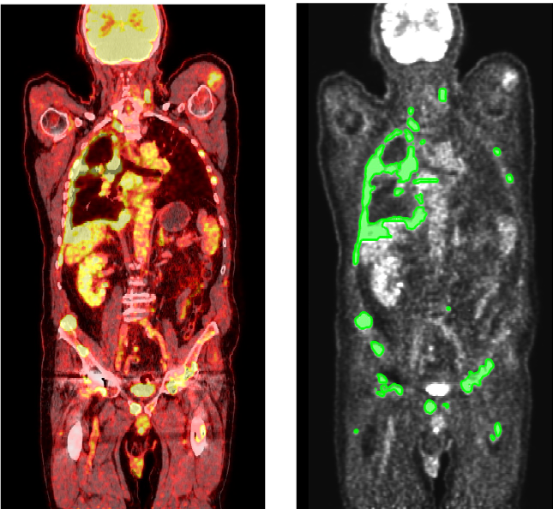
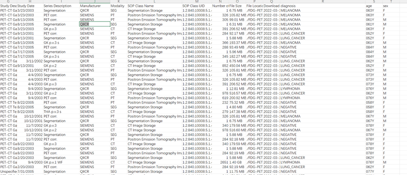
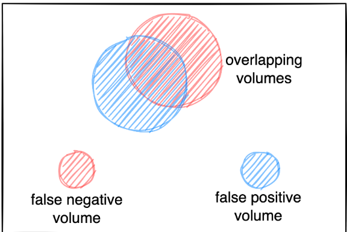
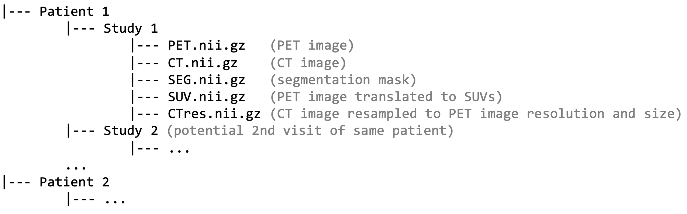

# 5.22 nifti

## 实验过程

- [x] 查看数据集
- [x] 处理数据集
- [x] 加载数据集
- [x] 图像标记

---

## 实验环境

- Python 3 Google Compute Engine

- Pytorch 1.8.1+cu111 

- TCIA

---

## 实验步骤

### 查看数据集

- 扫描重建参数：

1. CT参数：参考剂量为200 mAs，管电压为120 kV，切片厚度为2 - 3 mm的迭代重建。

2. PET参数：静脉注射60-300 MBq 350F-FDG后18分钟进行全身FDG-PET扫描。使用有序子集期望最大化（OSEM）算法重建，该算法具有21个子集和2次迭代，高斯核为2 mm，矩阵大小为400 x 400。



- 查看CSV信息，包含患者临床诊断信息。



- 目标是准确检测和分割全身FDG-PET/CT中对FDG亲和肿瘤病变，避免假阳性的同时对生理上具有高FDG摄取的解剖结构（例如大脑，肾脏，心脏等）进行分割，同时捕获所有肿瘤病变。测试指标为交并比（Dice）系数，假阳性体积，假阴性体积。

```
1. Foreground Dice score of segmented lesions
2. Volume of false positive connected components that do not overlap with positives (=false positive volume)
3. Volume of positive connected components in the ground truth that do not overlap with the estimated segmentation mask (=false negative volume)
```



- nnUNet_baseline，MONAI_uNet_baseline是使用的baseline模型。

### 处理数据集

- 初步预处理后数据集格式如下。包含PET图像，CT图像，标注图像。SUV.nii.gz包含PET图像的SUV信息，CTres.nii.gz将CT图像与PET图像重采样对齐。



- 查看CSV信息


### 划分训练集与测试集

- 所有的图像标记都在PET图像上进行，诊断信息在CSV文件中。提供的1014名患者的数据，从中分出507名做训练集，507名做测试集。


### 遇到的问题

- 部分SEG文件打开后全黑，看不到标记
原因：对应的study的diagnosis为NEGATIVE是临床检验阴性，没有标记；MELANOMA或LUNG_CANCER或其他病变的是临床检验阳性，有标记。


