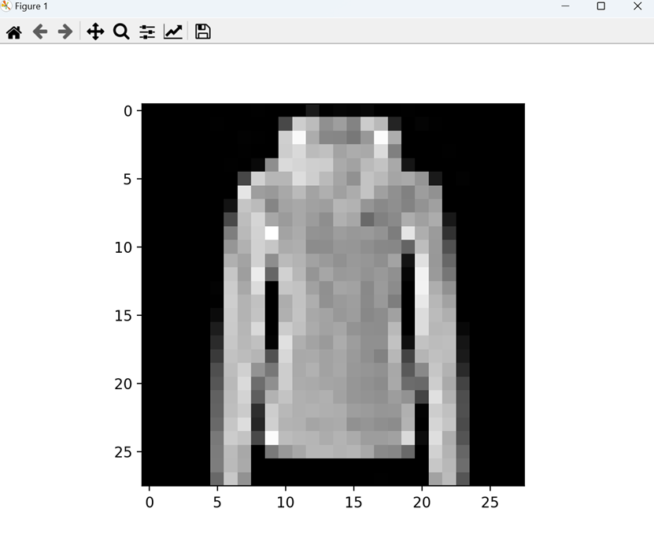
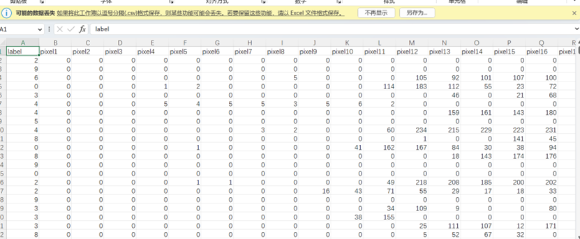
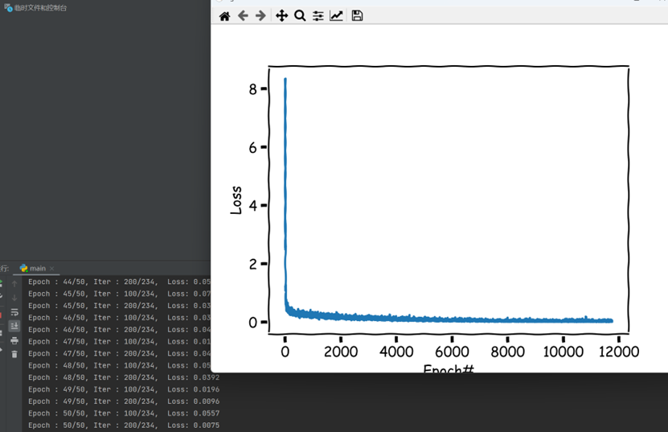
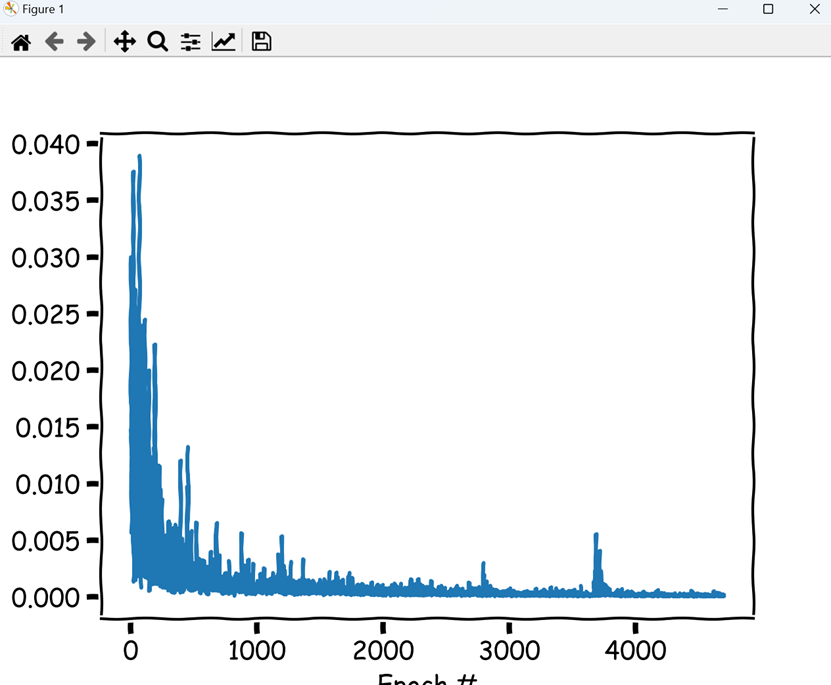
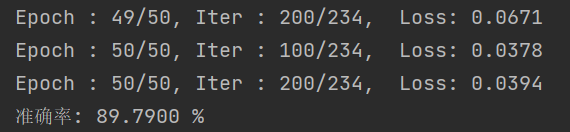

# 5.8 pytorch学习，Fashion MNIST分类

## 实验过程

- [x] 下载和处理数据集
- [x] 创建CNN网络
- [x] 训练CNN网络
- [x] 测试CNN网络
- [x] 保存和加载模型
- [x] 模型评估

---

## 实验环境

- Windows 11

- Python 3.9.7

- Pytorch(1.12.1+cu113)

---

## 实验步骤
### 下载和处理数据集

- [Fashion-MNIST](https://github.com/zalandoresearch/fashion-mnist) 是 Zalando 文章图像的数据集，由 60，000 个示例的训练集和 10，000 个示例的测试集组成。每个示例都是一个 28x28 灰度图像，与 10 个类的标签相关联。每张图像高 28 像素，宽 28 像素，总共 784 像素。每个像素都有一个与之关联的像素值，指示该像素的明暗度，数字越大表示越暗。像素值是介于 0 和 255 之间的整数。



- 对原始数据集进行处理，将训练和测试数据集写入CSV,CSV有 785 列。第一列由类标签组成，表示服装的物品。其余列包含关联图像的像素值。



```
def convert(imgf, labelf, outf, n):
    f = open(imgf, "rb")
    o = open(outf, "w")
    l = open(labelf, "rb")

    f.read(16)
    l.read(8)
    images = []

    for i in range(n):
        image = [ord(l.read(1))]
        # 数组中写入标签
        for j in range(28*28):
            image.append(ord(f.read(1)))
        images.append(image)
        # 写入像素值

    for image in images:
        o.write(",".join(str(pix) for pix in image)+"\n")
    f.close()
    o.close()
    l.close()

convert("train-images-idx3-ubyte", "train-labels-idx1-ubyte",
        "mnist_train.csv", 60000)
convert("t10k-images-idx3-ubyte", "t10k-labels-idx1-ubyte",
        "mnist_test.csv", 10000)
```

- 使用pytorch的dataloader进行数据的加载，创建自定义的dataset。

```
class FashionMNISTDataset(Dataset):
    # 初始化
    def __init__(self, csv_file, transform=None):
        data = pd.read_csv(csv_file)
        self.X = np.array(data.iloc[:, 1:]).reshape(-1, 1, 28, 28).astype(float)
        self.Y = np.array(data.iloc[:, 0])
        del data  # 结束data对数据的引用,节省空间
        self.len = len(self.X)
    # 返回数据集总数
    def __len__(self):
        return self.len
    # 返回单张图片
    def __getitem__(self, idx):
        item = self.X[idx]
        label = self.Y[idx]
        return item, label

# 设置训练集，测试集，batch_size
train_dataset = FashionMNISTDataset(csv_file=DATA_PATH / "fashion-mnist_train.csv")
test_dataset = FashionMNISTDataset(csv_file=DATA_PATH / "fashion-mnist_test.csv")

BATCH_SIZE = 256
train_loader = DataLoader(dataset=train_dataset, batch_size=BATCH_SIZE, shuffle=True)
test_loader = DataLoader(dataset=test_dataset, batch_size=BATCH_SIZE, shuffle=False)
```

### 创建CNN网络

- 创建三层CNN网络，

```
class CNN(nn.Module):
    def __init__(self):
        super(CNN, self).__init__()
        self.layer1 = nn.Sequential(
            nn.Conv2d(1, 16, kernel_size=5, padding=2),
            nn.BatchNorm2d(16),
            nn.ReLU())  # 16, 28, 28
        self.pool1 = nn.MaxPool2d(2)  # 16, 14, 14
        self.layer2 = nn.Sequential(
            nn.Conv2d(16, 32, kernel_size=3),
            nn.BatchNorm2d(32),
            nn.ReLU())  # 32, 12, 12
        self.layer3 = nn.Sequential(
            nn.Conv2d(32, 64, kernel_size=3),
            nn.BatchNorm2d(64),
            nn.ReLU())  # 64, 10, 10
        self.pool2 = nn.MaxPool2d(2)  # 64, 5, 5
        self.fc = nn.Linear(5 * 5 * 64, 10)

    def forward(self, x):
        out = self.layer1(x)
        # print(out.shape)
        out = self.pool1(out)
        # print(out.shape)
        out = self.layer2(out)
        # print(out.shape)
        out = self.layer3(out)
        # print(out.shape)
        out = self.pool2(out)
        # print(out.shape)
        out = out.view(out.size(0), -1)
        # print(out.shape)
        out = self.fc(out)
        return out
```

### 训练网络

- 使用GPU进行计算，使用Adam优化器，学习率为0.01，损失函数为交叉熵损失函数。

```
DEVICE = torch.device("cpu")
if torch.cuda.is_available():
    DEVICE = torch.device("cuda")
print(DEVICE)

cnn = cnn.to(DEVICE)

criterion = nn.CrossEntropyLoss().to(DEVICE)

LEARNING_RATE = 0.01
optimizer = torch.optim.Adam(cnn.parameters(), lr=LEARNING_RATE)
```

- 指定训练批次，训练并输出

```
TOTAL_EPOCHS = 50
losses = []
for epoch in range(TOTAL_EPOCHS):
    for i, (images, labels) in enumerate(train_loader):
        images = images.float().to(DEVICE)
        labels = labels.to(DEVICE)

        optimizer.zero_grad()  # 梯度清零
        outputs = cnn(images)
        loss = criterion(outputs, labels)  # 计算损失函数
        loss.backward()
        optimizer.step()
        losses.append(loss.cpu().data.item())
        if (i + 1) % 100 == 0:
            print('Epoch : %d/%d, Iter : %d/%d,  Loss: %.4f' % (
            epoch + 1, TOTAL_EPOCHS, i + 1, len(train_dataset) // BATCH_SIZE, loss.data.item()))
```

- 可视化输出



```
plt.xkcd()
plt.xlabel('Epoch#')
plt.ylabel('Loss')
plt.plot(losses)
plt.show()
```

### 测试网络

- 修改学习率和批次




```
cnn.train()
LEARNING_RATE = LEARNING_RATE / 10
TOTAL_EPOCHS = 20
optimizer = torch.optim.Adam(cnn.parameters(), lr=0.001)
losses = []
for epoch in range(TOTAL_EPOCHS):
    for i, (images, labels) in enumerate(train_loader):
        images = images.float().to(DEVICE)
        labels = labels.to(DEVICE)
        # 清零
        optimizer.zero_grad()
        outputs = cnn(images)
        # 计算损失函数
        loss = criterion(outputs, labels).cpu()
        loss.backward()
        optimizer.step()
        losses.append(loss.data.item())
        if (i + 1) % 100 == 0:
            print('Epoch : %d/%d, Iter : %d/%d,  Loss: %.4f' % (
            epoch + 1, TOTAL_EPOCHS, i + 1, len(train_dataset) // BATCH_SIZE, loss.data.item()))
```

### 保存和加载模型

- 使用save和load函数保存和加载模型

```
torch.save(cnn.state_dict(),"f_m_c-cnn3.pth")
#cnn.load_state_dict(torch.load("f_m_c-cnn3.pth"))
```

### 模型评估

- 将网络的模式改为eval。将图片输入到网络中得到输出。通过取出one-hot输出的最大值来得到输出的标签。统计正确的预测值。



```
cnn.eval()
correct = 0
total = 0
for images, labels in test_loader:
    images = images.float().to(DEVICE)
    outputs = cnn(images).cpu()
    _, predicted = torch.max(outputs.data, 1)
    # 按列求最大值
    total += labels.size(0)
    correct += (predicted == labels).sum()
print('准确率: %.4f %%' % (100 * correct / total))
```
---

## 下周计划

- 学习其他模型的使用方法，如RNN，Transformer等。

- 学习其他数据格式的数据集的使用方法，如CIFAR-10，CIFAR-100等。